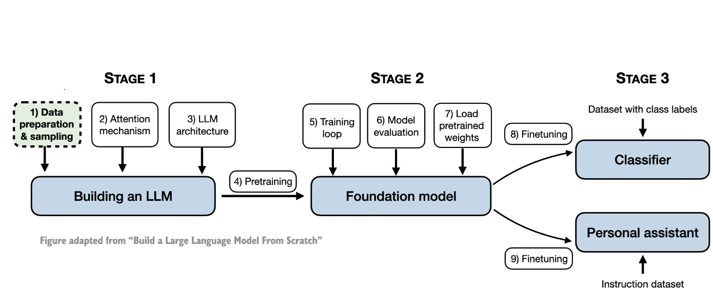
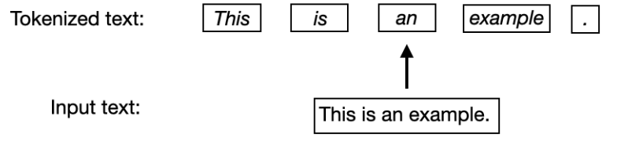
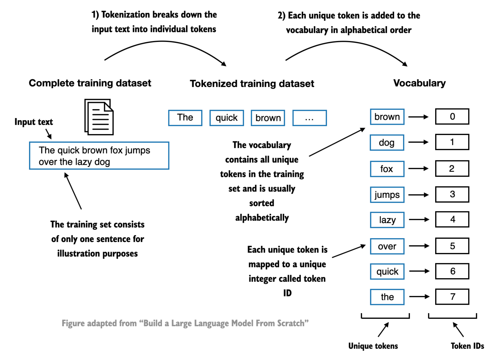
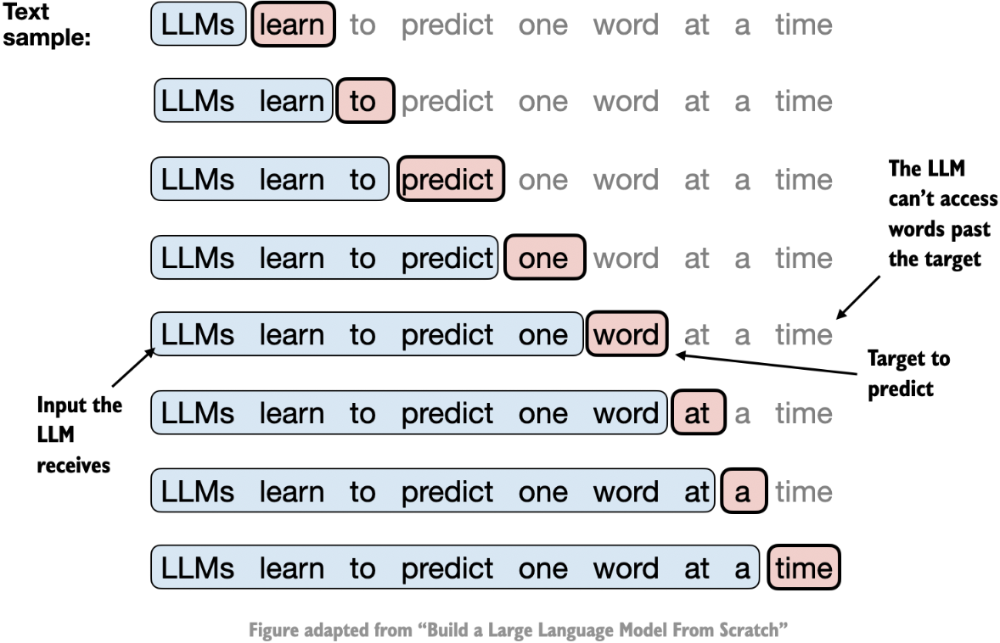
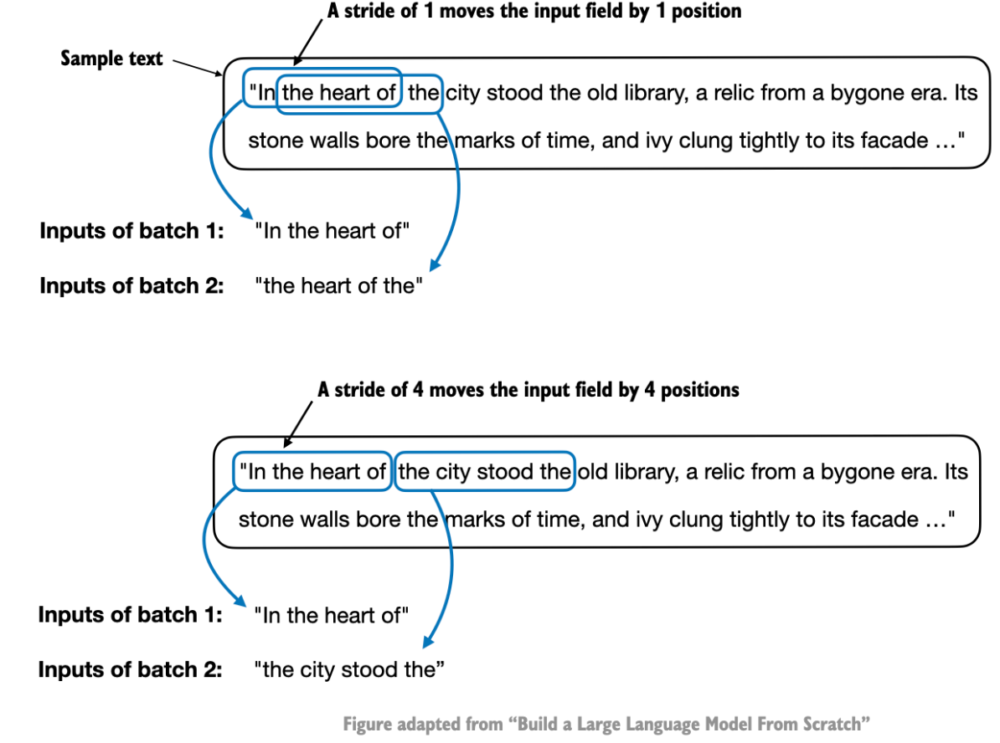

Title: A Simple Tokenizer
Date: 2024-08-31
Category: Scratch
Tags: LLMs From Scratch, Tokenizer

It's the Labor Day weekend, and I have found myself an amazing coding workshop by Building LLMs from the Ground Up: A 3-hour Coding Workshop by Sebastian Raschka, so here I am writing, understanding and building 'A Simple Tokenizer' from scratch. The figures in this blog post are taken from Sebastian Raschka's book "Build a Large Language Model From Scratch" until explicitly mentioned otherwise and the code is inspired from the aforementioned YouTube video. So let's get started, shall we?


Below is a pipeline of steps needed to build a large language model from scratch. We're currently at Stage 1, Step 1.



### Text Tokenization
Text tokenization means breaking text into smaller units, such as individual words and punctuation characters. 



To take an example text, let us assume the text we are building our LLM on is contained to [The Verdict by Edith Wharton](https://en.wikisource.org/wiki/The_Verdict) which is a public domain short story.

```python
with open("data/verdict.txt", "r", encoding="utf-8") as f:
    text = f.read()

print("Sample text", text[:100])
print("Raw text length:", len(text))
print("Number of unique characters:", len(set(text)))
```

```
Sample text I HAD always thought Jack Gisburn rather a cheap genius--though a good fellow enough--so it was no g
Raw text length: 20479
Number of unique characters: 62
```

A simple tokenizer can be built of simply using regular expressions. The regular expression will split the words by whitespaces, punctuations to yield smaller chunks of words.

```python
import re

# Split the text into words and punctuation marks using regular expressions
preprocessed_text = re.split(r"([,.:;?!{}()_=]|--|\s)", text)
print("Sample preprocessed text", preprocessed_text[:100])
print("Number of tokens (words and punctuation marks):", len(preprocessed_text))
print("Number of unique tokens (words and punctuation marks):", len(set(preprocessed_text)))
```

```
Sample preprocessed text ['I', ' ', 'HAD', ' ', 'always', ' ', 'thought', ' ', 'Jack', ' ', 'Gisburn', ' ', 'rather', ' ', 'a', ' ', 'cheap', ' ', 'genius', '--', 'though', ' ', 'a', ' ', 'good', ' ', 'fellow', ' ', 'enough', '--', 'so', ' ', 'it', ' ', 'was', ' ', 'no', ' ', 'great', ' ', 'surprise', ' ', 'to', ' ', 'me', ' ', 'to', ' ', 'hear', ' ', 'that', ',', '', ' ', 'in', ' ', 'the', ' ', 'height', ' ', 'of', ' ', 'his', ' ', 'glory', ',', '', ' ', 'he', ' ', 'had', ' ', 'dropped', ' ', 'his', ' ', 'painting', ',', '', ' ', 'married', ' ', 'a', ' ', 'rich', ' ', 'widow', ',', '', ' ', 'and', ' ', 'established', ' ', 'himself', ' ', 'in', ' ', 'a', ' ']
Number of tokens (words and punctuation marks): 8773
Number of unique tokens (words and punctuation marks): 1186
```

### Convert token to token IDs

Now that we have tokens, it is vital to convert the text tokens into token IDs that we can process via embedding layers later. 



Consider this as a unique mapping of word to integer that represent the word. For this, we will build a vocabulary for all words in the dataset. Extract all unique tokens and assign unique token id. The vocabulary thus contains all unique words in the input text.

```python3

# Build the vocabulary
vocab = sorted(set(preprocessed_text))
print("Vocabulary size:", len(vocab)) # Vocabulary size: 1186

# Assign an index to each word in the vocabulary and create a mapping between words and indices, i.e, encode
word_to_index = {word: i for i, word in enumerate(vocab)}

# Similarly, we can build an index to word dictionary to easily convert indices back to words i.e, decode
index_to_word = {i: word for i, word in enumerate(vocab)}

# Example of encoding and decoding
print("Encoding of 'the':", word_to_index["the"]) # Encoding of 'the': 1038
print("Decoding of 846:", index_to_word[846]) # Decoding of 846: pretty
```

This can be tied together in a Simple Tokenizer class, that takes care of chunking the data using regular expressions and further exposes encoding and decoding functions.

```python
class SimpleTokenizer:
    def __init__(self, vocab):
        self.vocab = vocab
        self.word_to_index = {word: i for i, word in enumerate(vocab)}
        self.index_to_word = {i: word for i, word in enumerate(vocab)}

    def encode(self, text):
        preprocessed_text = re.split(r"([,.:;?!{}()_=]|--|\s)", text)
        return [self.word_to_index[word] for word in preprocessed_text]

    def decode(self, indices):
        text = [self.vocab[i] for i in indices]
        return "".join(text)

tokenizer = SimpleTokenizer(vocab)
text = """"It's the last he painted, you know, Mrs. Gisburn said with pardonable pride."""

encoded_text = tokenizer.encode(text)
print("Encoded text:", encoded_text)
print("Decoded text:", tokenizer.decode(encoded_text))

```

```
Encoded text: [21, 2, 1038, 2, 659, 2, 585, 2, 802, 66, 0, 2, 1180, 2, 653, 66, 0, 2, 122, 68, 0, 2, 93, 2, 905, 2, 1162, 2, 810, 2, 849, 68, 0]
Decoded text: "It's the last he painted, you know, Mrs. Gisburn said with pardonable pride.
```

### BytePair Encoding

The issue with our tokenizer is that it cannot handle unknown characters outside our vocabulary range. It is tied to the words already seen. GPT-2 used BytePair encoding (BPE) as its tokenizer. It allows the model to break down words that aren't in its predefined vocabulary into smaller subword units or even individual characters, enabling it to handle out-of-vocabulary words. For instance, if GPT-2's vocabulary doesn't have the word "unfamiliarword," it might tokenize it as ["unfam", "iliar", "word"] or some other subword breakdown, depending on its trained BPE merges. The original BPE tokenizer can be found here, [BPE.](https://github.com/openai/gpt-2/blob/master/src/encoder.py)

Suppose we have data aaabdaaabac which needs to be encoded (compressed). The byte pair aa occurs most often, so we will replace it with Z as Z does not occur in our data. So we now have ZabdZabac where Z = aa. The next common byte pair is ab so let’s replace it with Y. We now have ZYdZYac where Z = aa and Y = ab. The only byte pair left is ac which appears as just one so we will not encode it. We can use recursive byte pair encoding to encode ZY as X. Our data has now transformed into XdXac where X = ZY, Y = ab, and Z = aa. It cannot be further compressed as there are no byte pairs appearing more than once. We decompress the data by performing replacements in reverse order.

BPE tokenizer from OpenAI's open-source [tiktoken](https://github.com/openai/tiktoken) library, Tiktoken, implements its core algorithms in Rust to improve computational performance.

### Data Sampling with Sliding Window

After converting text into word tokens represented as token ID numbers, we need to create the data loading for LLMs. LLMs are trained to generate one word at a time, so we prepare the training data accordingly where the next word in a sequence represents the target to predict.



To create the training set, a sliding window approach is used which adjusts the input position by +1 for the next pair of input-output sets. Input-output pairs thus look like-
```
<'LLMs learn to', 'learn to predict'>
<'learn to predict', 'to predict one'>
<'to predict one', 'predict one word'> 
```
... and so on. Essentially the target's last word is the predicted word. 

You might notice that we do have several repeated phrases in our training input set now, to avoid this, we use stride as a way to avoid overlaps. In practice it's best to set the stride equal to the context length so that we don't have overlaps between the inputs (the targets are still shifted by +1 always).



### Creating a DataLoader

From above, we can create a PyTorch dataset with input-target pairs.

```python3 

import torch
from torch.utils.data import Dataset, DataLoader


class GPTDataset(Dataset):
    def __init__(self, text, tokenizer, context_length, stride):
        self.tokenizer = tokenizer
        self.input = []
        self.target = []

        tokens = self.tokenizer.encode(text, allowed_special={"<|endoftext|>"})

        for i in range(0, len(text) - context_length, stride):
            # Append the tokens from i to i + context_length to the input list
            self.input.append(torch.tensor(tokens[i:i + context_length]))
            # Append the tokens from i + 1 to i + context_length + 1 to the target list
            self.target.append(torch.tensor(tokens[i+1 : i+context_length+1]))

    def __len__(self):
        return len(self.input)

    def __getitem__(self, idx):
        return self.input[idx], self.target[idx]


tokenizer = tiktoken.get_encoding("gpt2")
dataset = GPTDataset(verdict_text, tokenizer, context_length=16, stride=16) # In practice, context length is 1024 for gpt2

dataset.__getitem__(0)
```

```
(tensor([   40,   367,  2885,  1464,  1807,  3619,   402,   271, 10899,  2138,
           257,  7026, 15632,   438,  2016,   257]),
 tensor([  367,  2885,  1464,  1807,  3619,   402,   271, 10899,  2138,   257,
          7026, 15632,   438,  2016,   257,   922]))
```
As can be seen from above, the last token in input is 257, which forms the second last token for target and the next predicted token as 922. If we see the next input-output target, we can see that there is no overlapping of tokens in the inputs.

```python
dataset.__getitem__(1)
```

```
(tensor([ 922, 5891, 1576,  438,  568,  340,  373,  645, 1049, 5975,  284,  502,
          284, 3285,  326,   11]),
 tensor([5891, 1576,  438,  568,  340,  373,  645, 1049, 5975,  284,  502,  284,
         3285,  326,   11,  287]))
```

We can further form a DataLoader from this Dataset as below -

```python
dataloader = DataLoader(dataset, batch_size=16, shuffle=False)
```

And voila, you've created a custom dataloader for your dataset.


