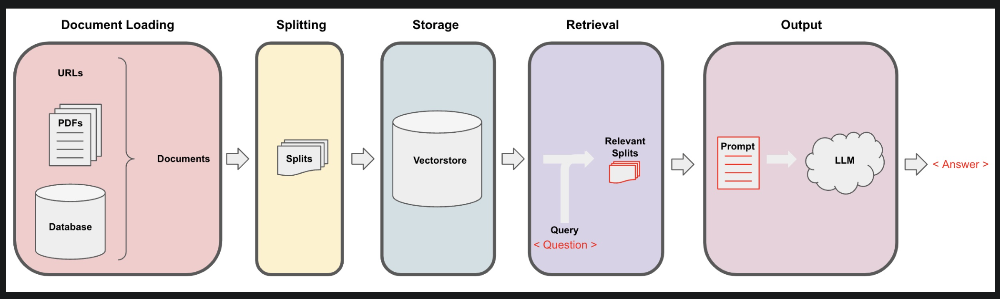
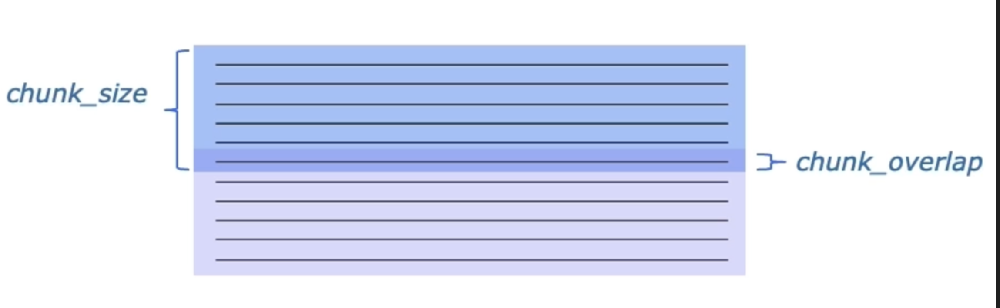
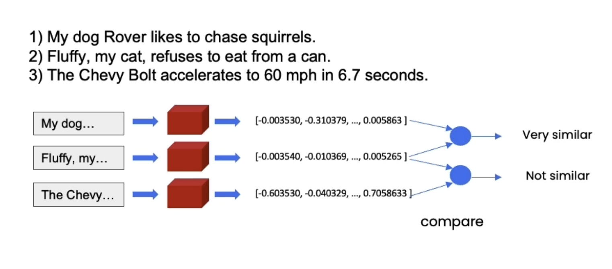
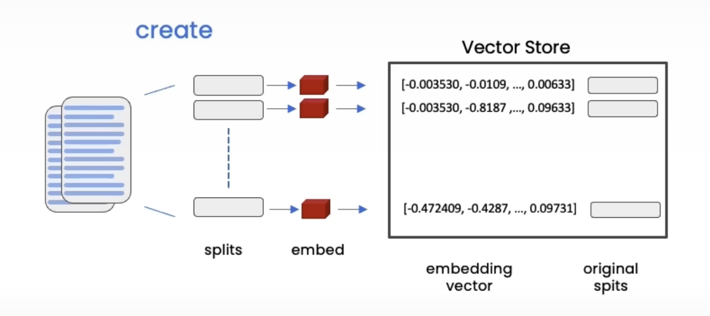
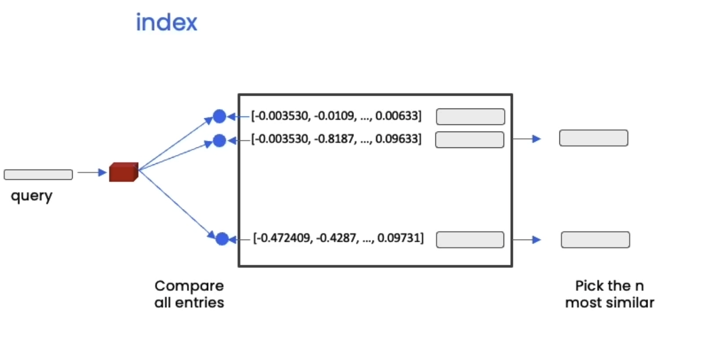

Title: Building Retrieval Augmented Generation Systems
Date: 2024-04-28
Modified: 2024-04-28
Category: LLMs
Tags: RAG, LLMs, Vector-Databases
Authors: Kashish Chanana
<!-- Status: Draft -->


RAG or Naive RAG is the concept of providing an LLM with additional context from an external knowledge source for knowledge injection and to reduce hallucinations. Although the concept of Retrieval-Augmented Generation (RAG) was already published in a paper by <a href="https://arxiv.org/abs/2005.11401"> Lewis et al. in 2020 </a>, it has gained a lot of interest since the release of ChatGPT.

It consists of two stages. First, an external knowledge source is prepared in the ingestion stage.
In the inference stage, this knowledge source is used to provide additional context to a user query. The retrieved context and user query are then used to augment a prompt template, which is used to generate an answer to the original user query.

This blog discusses a Naive RAG Pipeline, as provides pronounced code to perform QA on a YouTube Video. For the purpose of this blog, the YouTube video taken into account is <a href = "https://www.youtube.com/watch?v=zjkBMFhNj_g"> [1hr Talk] Intro to Large Language Models by Andrej Karpathy </a>




There are 5 steps that will be discussed. The first three belong to Ingestion stage and the last two belong to Inference stage.

1. Data Loading
2. Data Splitting
3. Vectore Storage
4. Semantic Retrieval
5. Output


### Preset
```
!pip install langchain openai chromadb pytube

# Using Open AI’s APIs to make direct API calls to LLM.

import os
import openai

from dotenv import load_dotenv, find_dotenv
_ = load_dotenv(find_dotenv()) # read local .env file
openai.api_key = os.environ['OPENAI_API_KEY']
```

---

### Document Loading

In retrieval augmented generation (RAG), an LLM retrieves contextual documents from an external dataset as part of its execution. This is useful if we want to ask question about specific documents (e.g., our PDFs, a set of videos, etc). Use document loaders to load data from a source as Document's. A Document is a piece of text and associated metadata. There are several document loaders that LangChain provides such as TextLoader, PyPDFLoader

In our case, this information will come via the `YouTube Loader` that LangChain offers.

```
from langchain.document_loaders import YoutubeLoader
%pip install --upgrade --quiet  youtube-transcript-api

loader = YoutubeLoader.from_youtube_url(youtube_url="https://www.youtube.com/watch?v=zjkBMFhNj_g", 
                                        add_video_info=True)

transcript = loader.load()

```

---

### Document Splitting

Once you've loaded documents, you'll want to transform them to better suit your application. You may want to split a long document into smaller chunks that can fit into your model's context window. LangChain has a number of built-in document transformers that make it easy to split, combine, filter, and otherwise manipulate documents.



Recursive Splitter - Recursively splits text. Splitting text recursively serves the purpose of trying to keep related pieces of text next to each other. RecursiveCharacterTextSplitter is recommended for generic text.

Token Splitter - Splits text on tokens. There exist a few different ways to measure tokens.This can be useful because LLMs often have context windows designated in tokens. Tokens are often ~4 characters.

Context aware splitting - Chunking aims to keep text with common context together. A text splitting often uses sentences or other delimiters to keep related text together but many documents (such as Markdown) have structure (headers) that can be explicitly used in splitting. Use MarkdownHeaderTextSplitter to preserve header metadata in our chunks. When reading information from Notion, it can be beneficial to use MarkdownHeaderTextSplitter.

In our case, we'll go with RecursiveCharacterTextSplitter with a `chunk_size` of 500 characters and a `chunk_overlap` of 25 chars.

```
from langchain.text_splitter import RecursiveCharacterTextSplitter
text_splitter = RecursiveCharacterTextSplitter(chunk_size = 500,
                                               chunk_overlap=25)
docs = text_splitter.split_documents(transcript)
```

---

### Vector Stores and Embeddings

Embeddings create a vector representation of a piece of text. This is useful because it means we can think about text in the vector space, and perform semantic search where we look for pieces of text that are most similar in the vector space.




One of the most common ways to store and search over unstructured data is to embed it and store the resulting embedding vectors, and then at query time to embed the unstructured query and retrieve the embedding vectors that are 'most similar' to the embedded query. A vector store takes care of storing embedded data and performing vector search for you.
Let's start by creating the embeddings of the docs. We'll employ `Chroma DB` as our vector store.


```
from langchain.vectorstores import Chroma
from langchain.embeddings.openai import OpenAIEmbeddings
embedding = OpenAIEmbeddings()


persist_directory = 'docs/chroma/'


vectordb = Chroma.from_documents(
    documents=docs,
    embedding=embedding,
    persist_directory=persist_directory
)

We can now perform a search on this vector database using a query. We can either do a `similarity search` or do a `similarity search by vector`. It is also possible to do a search for documents similar to a given embedding vector using similarity_search_by_vector which accepts an embedding vector as a parameter instead of a string. Here the parameter `k` represents the number of docs that will be retrieved based on the query.
```



Similarity Search

```
question = "What was said about LLM OS?"
retrieved_docs = vectordb.similarity_search(
    query=question,
    k=3)
```

Similarity search by vector

```
embedding_vector = OpenAIEmbeddings().embed_query(question)
retrieved_docs = vectordb.similarity_search_by_vector(
    embedding_vector,
    k=3)
```