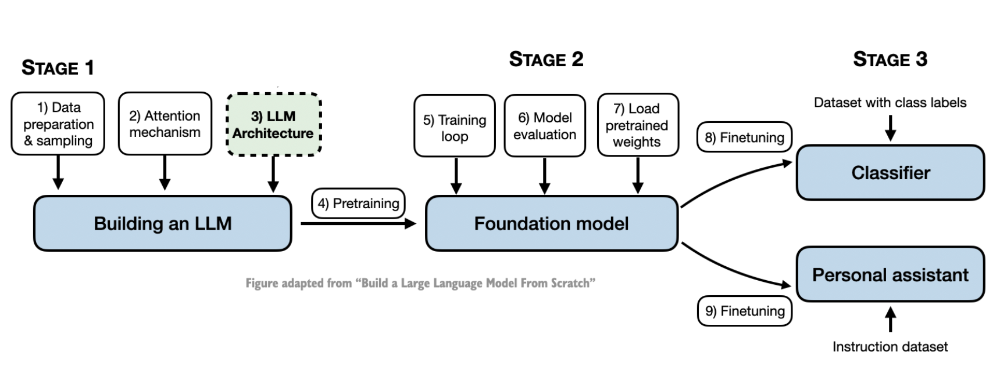
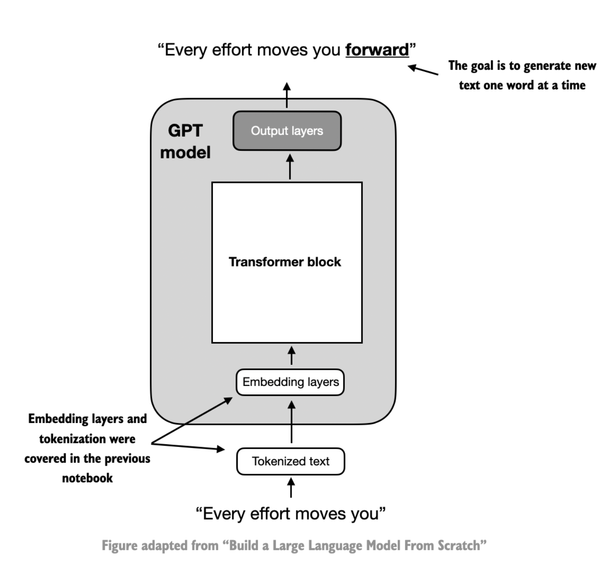
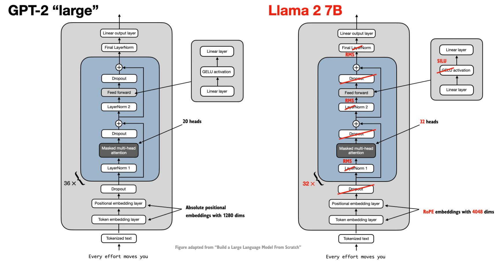
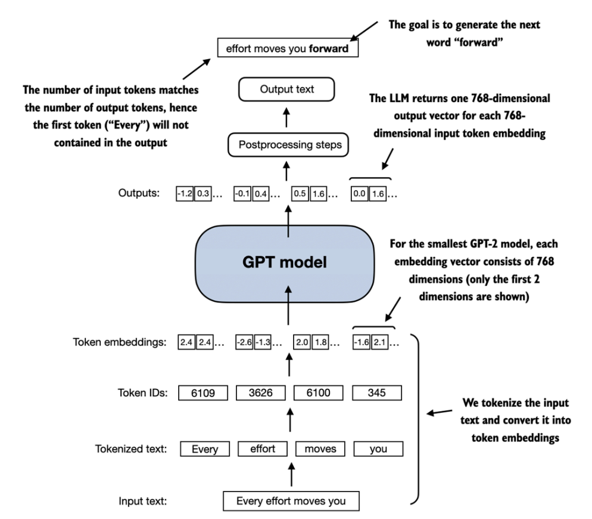
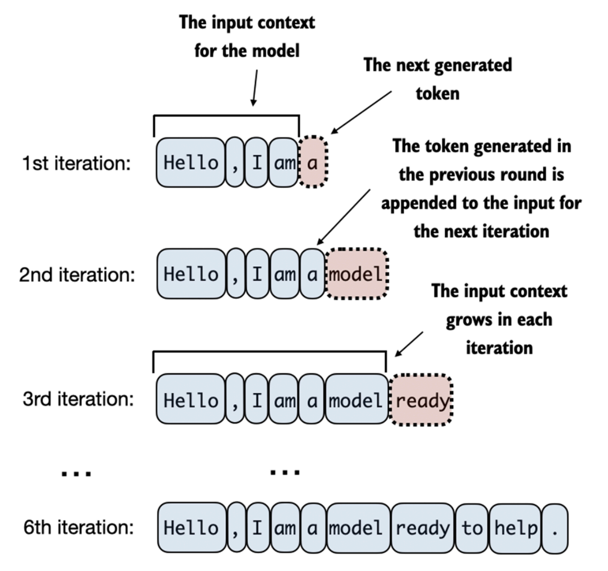
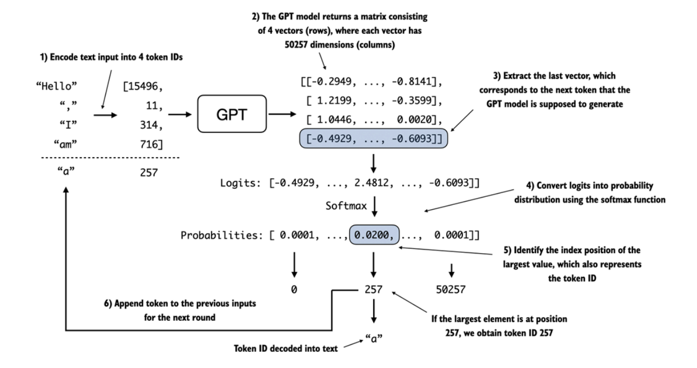

Title: Coding an LLM Architecture
Date: 2024-09-01
Category: LLMs
Tags: LLMs From Scratch, Architecture

This blog post is a Part II of building an LLM from scratch. This is yet again inspired by a coding workshop - Building LLMs from the Ground Up: A 3-hour Coding Workshop by Sebastian Raschka. As in the below diagram of contructing an LLM ground up, let's assume that we've a black box 'Attention Mechanism' ready with us, and we are jumping straight ahead to Part 3, LLM Architecture. I'd revisit Part 2 Attention Mechanism in a different blog post. This way of learning helps me, as I get to understand the high level architecture before diving deep into any of the phases! We will begin with a top-down view of the model architecture in the next section before covering the individual components in more detail.



### Coding a GPT-like LLM
LLMs, such as GPT (which stands for Generative Pretrained Transformer), are large deep
neural network architectures designed to generate new text one word (or token) at a time. Below is a mental model of a GPT model. The tokenized text moves into the embedding layers, and further to it one or more transformer blocks containing the masked multi-head attention module. It is then followed by a set of output layers. The goal remains to generate one word at a time.



 The sizing of models, GPT-2 'small' vs GPT-2 'large' is due to the number of transformer blocks and multi head attention heads in the construction. GPT-2 small has 12 tranformer blocks with 12 attention heads each whereas GPT 2 large contains 36 transformer blocks with 20 attention heads each. Compared to conventional deep learning models, LLMs are larger, mainly due to their vast number of parameters, not the amount of code.


The construction of the GPT model remains fairly consistent across the various offerings of large language models (GPT, Gemma, Phi, Mistral, Llama etc.) as they are all essentially based on the same concepts. They do have a few additions/subtractions. 



The DummyGPTModel class in below code defines a simplified version of a GPT-like model usingPyTorch's neural network module (nn.Module). The model architecture in the DummyGPTModel class consists of token and positional embeddings, dropout, a series of transformer blocks (DummyTransformerBlock), a final layer normalization (DummyLayerNorm), and a linear output layer (out_head). The configuration of the small GPT-2 model via the following Python dictionary.


```python
GPT_CONFIG_124M = {
    "vocab_size": 50257,    # Vocabulary size refers to a vocabulary of 50,257 words, as used by the BPE tokenizer 
    "context_length": 1024, # Context length denotes the maximum number of input tokens the model can handle
    "emb_dim": 768,         # Embedding dimension represents the embedding size,
    "n_heads": 12,          # Number of attention heads in the multi-head attention mechanism
    "n_layers": 12,         # Number of layers, i.e, the number of transformer blocks in the model
    "drop_rate": 0.0,       # Dropout rate, indicates the intensity of the dropout mechanism 
    "qkv_bias": False       # Query-Key-Value bias, determines whether to include a bias vector in the Linear
                            # layers of the multi-head attention for query, key, and value computations
}
```

The forward method describes the data flow through the model: it computes token and positional embeddings for the input indices, applies dropout, processes the data through the transformer blocks, applies normalization, and finally produces logits with the linear output layer.


```python

class DummyGPTModel(nn.Module):

    def __init__(self, config):
        super().__init__()
        self.token_emb = nn.Embedding(num_embeddings=config["vocab_size"], 
                                      embedding_dim=config["emb_dim"])
        self.position_emb = nn.Embedding(num_embeddings=config["context_length"], 
                                         embedding_dim=config["emb_dim"])
        self.dropout = nn.Dropout(p=config["drop_rate"])
        self.transformer_blocks = nn.Sequential(*[DummyTransformerBlock(config) for _ in range(config["n_layers"])])
        self.layer_norm = DummyLayerNorm(config["emb_dim"])
        self.out_head = nn.Linear(in_features=config["emb_dim"], out_features=config["vocab_size"])


    def forward(self, in_idx):
        batch_size, seq_len = in_idx.size()
        token_embeddings = self.token_emb(in_idx)
        position_embeddings = self.position_emb(torch.arange(seq_len, device=in_idx.device))
        embeddings = token_embeddings + position_embeddings
        x = self.dropout(embeddings)
        x = self.transformer_blocks(x)
        x = self.layer_norm(x)
        logits = self.out_head(x)
        return logits
```



Assuming that the DummyTransformerBlock and DummyLayerNorm are implemented. To generate the next set of words, we tokenize a batch consisting of two text inputs for the GPT model using the tiktoken tokenizer. 

```python

import tiktoken

tokenizer = tiktoken.get_encoding("gpt2")

batch = []

txt1 = "Every effort moves you"
txt2 = "Every day holds a"

batch.append(torch.tensor(tokenizer.encode(txt1)))
batch.append(torch.tensor(tokenizer.encode(txt2)))
batch = torch.stack(batch, dim=0)
print(batch)
```

The resulting token IDs for the two texts are as follows:

```
tensor([[6109, 3626, 6100,  345],
        [6109, 1110, 6622,  257]])
```
Next, we initialize a new 124 million parameter DummyGPTModel instance and feed it the tokenized batch.
```python
torch.manual_seed(123)

model = DummyGPTModel(GPT_CONFIG_124M)

out = model(batch)
print("Input shape:", batch.shape)
print("Output shape:", out.shape)
print(out)
```

The model outputs, which are commonly referred to as logits, are as follows -

```
Input shape: torch.Size([2, 4])
Output shape: torch.Size([2, 4, 50257])
tensor([[[-0.0061,  0.2018, -0.1894,  ...,  0.6021,  0.0023, -0.6446],
         [ 0.5441, -0.0973, -0.6294,  ..., -0.1285,  0.4564,  0.2919],
         [ 1.0331, -0.0616,  0.0528,  ...,  0.6333, -0.3860, -0.3187],
         [-0.6778,  0.0553, -0.3303,  ...,  1.1527,  0.1931, -0.7693]],

        [[ 0.1539,  0.0028,  0.0655,  ..., -0.1306,  0.5186, -0.1966],
         [ 0.0415, -0.2014,  0.1478,  ...,  0.6864, -0.2254,  0.4057],
         [ 1.0918,  0.6361, -0.0494,  ...,  0.6526,  0.5259, -0.1022],
         [ 0.5160,  0.2702,  0.6313,  ...,  0.7390,  0.0222,  0.0687]]],
       grad_fn=<ViewBackward0>)
```
The output tensor has two rows corresponding to the two text samples. Each text sample consists of 4 tokens; each token is a 50,257-dimensional vector, which matches the size of the tokenizer's vocabulary. The embedding has 50,257 dimensions because each of these dimensions refers to a unique token in the vocabulary. The GPTModel implementation outputs
tensors with shape `[batch_size, num_token, vocab_size]`. 

Below is a step-by-step process by which a GPT model generates text given an input context, such as "Hello, I am," on a big-picture level. With each iteration, the input context grows, allowing the model to generate coherent and contextually appropriate text. By the 6th iteration, the model has constructed a complete sentence: "Hello, I am a model ready to help."



Now, the question is, how does a GPT model go from these output tensors to the generated text?
In each step, the model outputs a matrix with vectors representing potential next tokens. The vector corresponding to the next token is extracted and converted into a probability distribution via the softmax function. Within the vector containing the resulting probability scores, the index of the highest value is located, which translates to the token ID. This token ID is then decoded back into text, producing the next token in the sequence. Finally, this token is appended to the previous inputs, forming a new input sequence for the subsequent iteration. In practice, we repeat this process over many iterations until we reach a user-specified number of generated tokens.





In the below code, the generate_text_simple function, we use a softmax function to convert the logits into a probability distribution from which we identify the position with the highest value via torch.argmax. The softmax function is `monotonic`, meaning it preserves the order of its inputs when transformed into outputs. So, in practice, the softmax step is
redundant since the position with the highest score in the softmax output tensor is the same position in the logit tensor. In other words, we could apply the `torch.argmax` function to the logits tensor directly and get identical results. However, the conversion to illustrate the full process of transforming logits to probabilities, which can add additional
intuition, such as that the model generates the most likely next token, which is known as `greedy decoding`.

```python
def generate_text_simple(model, tokens, max_new_tokens, context_size):
    # idx is (batch, n_tokens) array of indices in the current context
    for _ in range(max_new_tokens):
        
        # Crop current context if it exceeds the supported context size
        context_tokens = tokens[:, -context_size:]
        
        # Get the predictions
        with torch.no_grad():
            logits = model(context_tokens)
        
        
        # Focus only on the last time step
        # (batch, n_tokens, vocab_size) becomes (batch, vocab_size)
        logits = logits[:, -1, :]  

        # Apply softmax to get probabilities
        probas = torch.softmax(logits, dim=-1)  # (batch, vocab_size)

        # Get the idx of the vocab entry with the highest probability value
        next_token = torch.argmax(probas, dim=-1, keepdim=True)  # (batch, 1)

        # Append sampled index to the running sequence
        tokens = torch.cat((tokens, next_token), dim=1)  # (batch, n_tokens+1)

    return tokens
```

Now, to generate the next words in the sentence `Hey, how are you doing today?`, we will pass this text tokens to our generate_text_simple function and use the decode method of the tokenizer to get human readable word.

```python
model.eval() # Set model to evaluation mode

text = "Hey, how are you doing today?"

tokens = tokenizer.encode(text)
tokens = torch.tensor(tokens).unsqueeze(0)

generated_tokens = generate_text_simple(model, tokens, 10, 10)

print("Generated tokens:\n", generated_tokens)
print("Generated text:\n", tokenizer.decode(generated_tokens[0].tolist()))
```

```
Generated tokens:
 tensor([[10814,    11,   703,   389,   345,  1804,  1909,    30, 32059, 47952,
         39382, 50160, 21458, 26766, 37602, 16006, 25952, 33724]])
Generated text:
 Hey, how are you doing today?767 testifying detects collaborator BooSilver Rudy cycles SSL burglary
```

 As can be seen from above, a rather gibberish sentence has been predicted to follow our given input. The reason why the model is unable to produce coherent text is that we haven't trained it yet. So far, we just implemented the GPT architecture and initialized a GPT model instance with initial random weights.