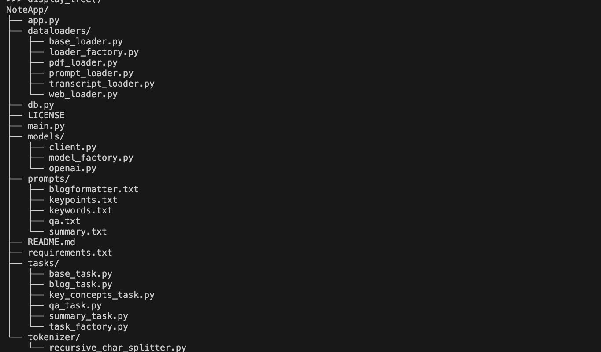
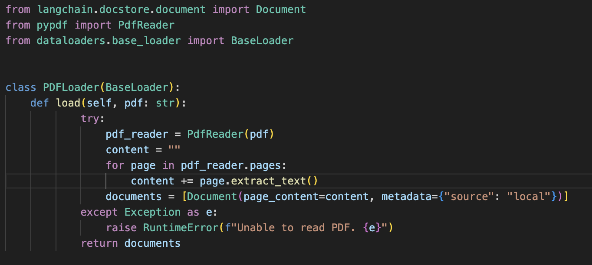

Title: TLDR; How I Built A Note Assistant
Date: 2024-06-23
Modified: 2024-06-23
Category: LLMs
Tags: Assistants, LLMs, RAGs, Weekend-Prototyping

As a dedicated note-taker, I often find myself struggling to keep up when watching YouTube videos. My process usually involves playing the video, pausing, taking notes, and then resuming—repeating this cycle multiple times. This routine not only becomes tedious but also significantly extends the time it takes to finish a video, often by 2x-3x the original length. Although having detailed notes to revisit concepts is beneficial, the painstaking task of constant pauses and rewinds can be quite frustrating. I believe, in someways it also affected my amount of ground I covered.

A couple of weekends ago, I decided to tackle this issue by creating a YouTube summary/blog assistant to ease my note-taking burden. Since then, I have continuously added more functionalities. The need for summarizing youtube videos extended to need for summarizing any article on the web and furthered to summarizing the PDFs I have of my own. Once I saw myself reaching out to this app multiple times, I went on to integrate it with a Vector DB that allowed me to perform semantic search on the reads/watches from the past. This made this prototype an invaluable tool for efficient learning (and recalling might I add!).

You might wonder why I decided to code this myself when there are several assistants available that can do similar tasks. Here are my reasons:

1. Comprehensive Information: Many services I found are optimized for client SLAs, often returning summaries after processing only the first 10 minutes of a 50-minute YouTube video or the first 5 pages of a 10-page PDF document. My priority was not to optimize for time but to ensure the generated information is complete, even if it takes longer.

2. Detailed Output: I wanted detailed, granular information rather than just high-level summaries. To achieve this, I make multiple model API calls, splitting the data into smaller parts and sending each as a separate prompt to OpenAI. With a budget of $500 in credits, I am comfortable making this extra investment for better results.

3. Personalized Semantic Search: I needed a system that offers semantic search capabilities on my database of reads. This personalized setup functions almost like a second brain, extending my memory and providing tailored information retrieval.

This assistant serves also as the culmination of my previous blogs, which explored the development of tools powered by Large Language Models (LLMs). It integrates OpenAI, LangChain, Pinecone Vector Database, and Streamlit to provide a seamless and efficient tooling.

## Quick Rant
One key aspect I focused on while building this project was organizing code in a structured and maintainable manner. After reviewing scores of notebooks on GitHub, I developed a strong aversion to code that resembles a whiteboard brainstorm—disorganized and treated as disposable. While such code can be a useful starting point and great for experimentation, it is far from how production systems should be built.

The general principles of code design used in software engineering should also be applied to machine learning prototypes.

 <em><a href ="https://www.linkedin.com/posts/yidewang_python-code-style-for-machine-learning-researchers-activity-7210668548220715008-m23r?utm_source=share&utm_medium=member_desktop"> Link To Post </a></em> 

Let's get started, shall we?

## Code Structure

The code is organized into five modules: dataloaders, models, prompts, tasks, and tokenizers. Each module is designed to handle specific responsibilities, ensuring a clear separation of concerns.

 <em> Code Structure </em>

<b>Prompts Module </b>- This module has the simplest structure but contains crucial information. It stores prompts for various tasks in text files, such as blogformatter.txt for creating blog posts and summary.txt for generating summaries. These prompts are loaded into memory through simple file read operations.

<b>Tokenizer Module </b>
This module hosts various tokenizers that can be employed in the project. Currently, the project uses the Recursive Character Splitter as its tokenizer.

These next three modules follow a similar structure, each featuring an abstract base class that defines the interface for its implementations. This pattern promotes code readability and maintainability.

<b>DataLoaders Module </b>
This module encompasses data loading tools. It leverages LangChain to fetch data from various sources. The BaseLoader class has a single method that must be overridden by its implementations. 

Implementations of this abstraction override this method.

By structuring the code in this modular way, the project ensures better organization, enhanced readability, and easier maintenance, all of which facilitate the application of software engineering design patterns. (you'll see soon!)

<b>Models Module </b>
This module is responsible for making client calls to various available model APIs. Currently, it makes calls to OpenAI. However, the BaseClient class can be extended to integrate other models, such as Claude or Gemini.

<b> Tasks Module </b>
And finally, this module is responsible for executing multiple tasks. Each task utilizes a selected model (e.g. GPT-3.5) to perform a generative function, using context gathered by the dataloaders (e.g., YouTube transcripts from videos). It then loads the relevant prompt based on the task and calls the model API to generate a response.

## Tying Modules Together
The main.py file integrates all components of the application. It employs <a href="https://refactoring.guru/design-patterns/factory-method"> Factory Pattern </a> to streamline operations. This script handles input_io (text/ web URL/ YouTube URL), along with the specified model and performs task. It retrieves the necessary class instance to load data, prepare the prompt, and decides which model API to call.
Generation is executed with a final `self.task.execute(model=self.model, context=context)` and voila the summary is loaded. Pretty neat, ain't it!

## Streamlit for UI
The UI is built with Streamlit. I believe it does a fantastic job getting some rough prototyping UI built with easy to write python scripting. I went to host my site at <a href ="https://noteapp.streamlit.app/"> NoteApp </a>. 

<!--  -->

## Pinecone Vector DB

I integrated with Pinecone vector DB, with the idea of performing a semantic search to retrieve relevant context from the database and passing it onto Open API to generate an answer to my query. In similarity search applications, data points are represented as vectors, with each dimension corresponding to a specific feature or attribute. Pinecone's primary goal is to enable fast and accurate similarity searches across extensive vector data.

Pinecone leverages advanced indexing and search algorithms to optimize the performance of similarity search queries. It employs an indexing technique called Approximate Nearest Neighbor (ANN) search, which efficiently retrieves vectors similar or closest to a given query vector. By using approximate methods, Pinecone can perform low-latency search operations, even with extremely large datasets.

## Final Retrieve
For the last bit, I can now retriev information from my past saved reads following Retrieval Augmented Generation. 

And Voila! There is a quick and helpful weekend prototype. View code at <a gref="https://github.com/KashishChanana/NoteApp"> https://github.com/KashishChanana/NoteApp </a>