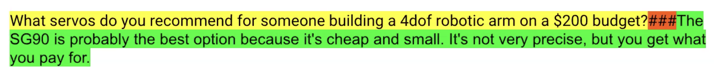
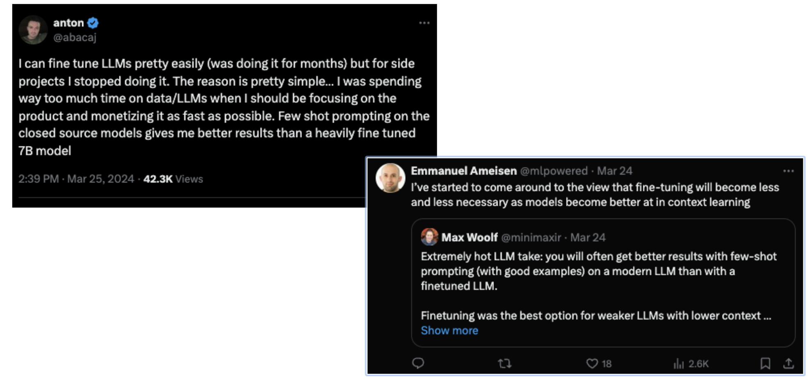

Title: When and Why to Fine-Tune an LLM
Date: 2024-05-19
Category: LLMs
Tags: Fine-Tuning, LLMs
Status: Draft

<i> These notes are from the <a href = "https://maven.com/parlance-labs/fine-tuning/"> Mastering LLMs: End-to-End Fine-Tuning and Deployment</a> course.</i>

1. Keep It Simple & Stupid
2. DO NOT start with fine-tuning. Prompt eng first.
3. Use OpenAI, Claude, etc.
4. “Vibe-checks” are OK in the beginning
5. Evals are important
6. Write simple tests & assertions 
7. Ship fast 

> What is Fine Tuning?
> Define input and output for fine tuning.
> Define input and outputs in a template. This is a very simple one, and templates in different circumstances can be much more complex. But we're going to have a string, which is, here's the input that's in yellow. We're going to have the output here that's highlighted in green, and we're going to have some tokens
in between, or one token in between. That is going to be our way of making the
model at inference time.
short circuit, all of the other training that it's had, and actually say, when I see this token, the likely next tokens after that, in this case, are an answer or a helpful answer, or a joke, or whatever we want the behavior to be. And so this is our way of training with
next token prediction, because that's how these models are trained, but have a way of short circuiting in this the that behavior, even something that may have been trained through billions of tokens. 

Need consistent templating between training & inference

> Hot Take

Models are getting better, incase of private information, you might have to but really try to work w/o finetunng. Try prompt engineering etc.  only do if necessary.

> Reasons to fine tune

Data privacy

Quality vs. latency tradeoff

Extremely narrow problem

Prompt engineering is impractical

RESULT: Fine-tuned model was faster, more compliant & higher quality vs. GPT 3.5

> Finetuning vs RAG? which one to choose?