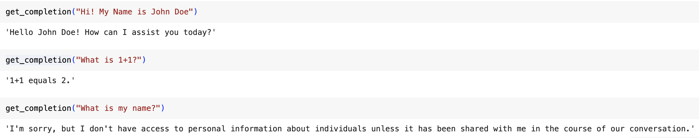

Title: LangChain - The Essentials
Date: 2024-02-26
Category: LLMs
Tags: Prompt-Engineering, LangChain


Prompting a large language model (LLM) allows for faster development of AI applications. However, this process often requires multiple prompts and parsing of the LLM's output, which can involve writing extensive code. To simplify this development process, LangChain was created by Harrison Chase. LangChain is an open-source framework designed for building LLM applications and has gained widespread community adoption and contributions.


---

## Key Features

LangChain provides two packages, one in Python and another in JavaScript. It emphasizes composition and modularity, offering various independent components that can be used together or separately. LangChain also offers different use cases and chains to combine these modular components into complete applications. The Langchain framework consists of six modules, each serving a different purpose in interacting with the LLM.

| Category | Subcategory | Integrations/Implementations |
| --- | --- | --- |
| Models | LLMs | 20+ |
|  | Chat Models |  |
|  | Text Embedding Models | 10+ |
| Prompts | Prompt Templates |  |
|  | Output Parsers | 5+ |
|  | Example Selectors | 10+ |
| Indexes | Document Loaders | 50+ |
|  | Text Splitters | 10+ |
|  | Vector Spaces | 10+ |
|  | Retrievers | 5+ |
| Chains | Prompt, LLM, Output parsing |  |
|  | Building Blocks |  |
|  | Application-specific Chains | 20+ types |
|  | Retrievers | 5+ |
| Agents | Agent Types | 5+ types |
|  | Agent Toolkits | 10+ implementations |

---

## Notebook Walkthrough

The examples in this notebook can be accessed through Google Colab Notebook [here.](https://colab.research.google.com/drive/1FM09FaY64sWMF0CykgzQ4PQNiqRtIs60?usp=sharing) Note that LLM's do not always produce the same results. When executing the code in your notebook, you may get slightly different result. 

---

## Models

Models refer to the language models that underpin many AI applications. When building an application using a large language model (LLM), there are often reusable models. We repeatedly prompt a model and parse its outputs, and LangChain provides easy abstractions to facilitate this type of operation.

💡 Using Langchain’s models provides us with multiple models in one place. Examples of chat models include Alibaba Cloud, Anthropic, Anyscale, Azure OpenAI, Azure ML, Baidu Chat, Cohere, Google AI, Google Cloud Vertex AI, Hugging Face, Llama API, LlamaEdge, MistralAI, NVIDIA AI Foundation Endpoints, OpenAI and many more.


Open AI’s API -
    
    
```
# Using Open AI’s APIs to make direct API calls to LLM.

import os
import openai

from dotenv import load_dotenv, find_dotenv
_ = load_dotenv(find_dotenv()) # read local .env file
openai.api_key = os.environ['OPENAI_API_KEY']

def get_completion(prompt, model="gpt-3.5-turbo"):
    messages = [{"role": "user", "content": prompt}]
    response = openai.chat.completions.create(
        model=model,
        messages=messages,
        temperature=0, 
    )
    return response.choices[0].message.content
get_completion("Who is the President of United States of America?")

```
    
The above code snippet outputs - 
    
```
As of September 2021, the President of the United States of America is Joe Biden.
```
    
*(Note: LLMs do not always produce the same results. When executing the code, you may get slightly different answers)*
    
LangChain’s Model - 
    
To get OpenAI’s chatGPT API endpoint, we can import it via langchain’s chat_models. 

```python
# This is langchain's abstraction for the chatGPT API Endpoint
from langchain.chat_models import ChatOpenAI

# To control the randomness and creativity of the generated text by an LLM, 
# use temperature = 0.0
chat = ChatOpenAI(temperature=0.0)
```

```
ChatOpenAI(verbose=False, callbacks=None, callback_manager=None, client=<class 'openai.api_resources.chat_completion.ChatCompletion'>, model_name='gpt-3.5-turbo-0301', temperature=0.0, model_kwargs={}, openai_api_key=None, openai_api_base=None, openai_organization=None, request_timeout=None, max_retries=6, streaming=False, n=1, max_tokens=None)
```

---

## Prompts

Prompts are essential for guiding a large language model (LLM) by providing specific instructions and desired outputs. They serve as inputs to the models and can be detailed and lengthy, specifying the format and expected results. Prompt templates are a helpful tool for reusing effective prompts, and LangChain offers built-in templates for various tasks like summarization, answering questions, and integrating with databases or APIs. [Refer here to learn more about Prompt Engineering.](https://www.notion.so/Prompt-Engineering-4191027a1ff0432f8f5c09813165326f?pvs=21)

Going back to the previous example, you can now chat with the previously defined language model by using ChatPromptTemplate.

```python
from langchain.prompts import ChatPromptTemplate

# Define a template string
template_string = """Who is the President of United States of America?"""

prompt_template = ChatPromptTemplate.from_template(template_string)

# Call the LLM to translate to the style of the customer message
llm_response = chat(prompt_template.format_messages())
print(llm_response)
```

And you get the same reply as before.

```
As of September 2021,the President of the United States of America is Joe Biden.
```

But how did this help us? Well, let's consider this scenario where you want to find the President of Germany or a set of 50 countries. Now, imagine having to write the prompt again and again for each country. It would be a huge hassle! LangChain eliminates this inconvenience by providing a streamlined solution. Instead of writing 50 prompts for each country, LangChain allows you to simplify the process and save time and effort.

We can now define the prompt template with an input variable as `country`

```python
template_string = """Who is the President of ```{country}```?"""
prompt_template = ChatPromptTemplate.from_template(template_string)
```

```python
prompt_template.messages[0].prompt

'''
Returns - 
PromptTemplate(input_variables=['country'], output_parser=None, partial_variables={}, template='Who is the President of ```{country}```?', template_format='f-string', validate_template=True)
'''
```

```python
prompt_template.messages[0].input_variables

'''
Returns - ['country']
'''
```

Now, to check who the President of Germany or any other country is, all we need to do is replace the input variable with a country of my choice.

```python
chat(prompt_template.format_messages(country="Germany")).content

'''
Returns - 
'As of September 2021, the President of Germany is Frank-Walter Steinmeier.'
'''
```

---

## Parsers

Output parsing is another important aspect of LangChain. When instructing an LLM to generate output in a specific format, such as using specific keywords or tags, parsers help extract and interpret the relevant information from the LLM's output. This allows for more precise control and easier downstream processing. 

Let us consider an example to find the names of 3 sports that don't use balls.

```python
list_item_string = """List names of 3 ```{things}```."""
item_template = ChatPromptTemplate.from_template(list_item_string)

chat(item_template.format_messages(things= "sports that don't use balls")).content

"""
Returns-

1. Swimming
2. Track and field
3. Gymnastics
"""
```

Great! Now, what if we wanted this in CSV format? By specifying these schemas and using LangChain's output parser, we can extract and format the relevant information from the LLM's response.

```python
# Import CommaSeparatedListOutputParser from the langchain.output_parsers module.
from langchain.output_parsers import CommaSeparatedListOutputParser

# Initialize an instance of CommaSeparatedListOutputParser.
output_parser = CommaSeparatedListOutputParser()

# Retrieve the format instructions for the output parser.
# This method likely returns a string or some form of instructions
# on how to format outputs to be compatible with this parser.
format_instructions = output_parser.get_format_instructions()

format_instructions

"""
Returns -
Your response should be a list of comma-separated values, eg: `foo, bar, baz`
"""
```

To use these format instructions, we simply add them to our template and evaluate them as partial variables.

```python
# Define a template string for listing items. The template includes placeholders
# for 'things' to list and 'format_instructions' that describe how the list 
# should be formatted.
list_item_template = """
List names of 3 ```{things}```

```{format_instructions}```
"""

# The 'from_template' method is used to instantiate the template object,
# and 'partial_variables' is used to provide predefined values for some of the
# variables within the template.
item_template_with_format_instructions = ChatPromptTemplate.from_template(
    list_item_template,
    partial_variables={"format_instructions": format_instructions}
)
```

Now, let's use this template to find the names of 3 sports that don't use balls in a CSV format.

```python
output = chat(item_template_with_format_instructions.format_messages(
things= "sports that don't use balls")).content
output

"""
Returns -
swimming, track and field, gymnastics
"""
```

If you were to go find the `type` of `output`, you’d see the type as a string. In order to get type as a `list`, simply use the parser to parse the output, and voila, you have a list with you.

```python
output_parser = CommaSeparatedListOutputParser()
output_parser.parse(output)
"""
Returns-
['swimming', 'track and field', 'gymnastics']
"""
```

As we’ve explored, these parsers enhance the usability of raw outputs and pave the way for more advanced applications and integrations. Langchain offers several output parsers that can be explored [here](https://python.langchain.com/docs/modules/model_io/output_parsers/).

---

## Memory

Using the previously defined `get_completion` function that uses OpenAI’s API, let's have a brief conversation.



When building applications like chatbots, a major challenge arises from the fact that language models typically do not retain information from past interactions. This limitation becomes apparent when we aim to have dynamic and continuous conversations with the model. In the field of conversational AI, the ability of language models to remember previous parts of a conversation becomes crucial for creating seamless and coherent interactions between users and AI assistants.

To address this issue, memory mechanisms are implemented to store and recall past conversations. These mechanisms enable a more natural and context-aware dialogue, allowing the language model to maintain a sense of continuity and better understand the user's intent.

### Conversational Memory Buffer

Let's start by importing the required modules and starting a conversation chain with our LLM.

```python
from langchain.chat_models import ChatOpenAI
from langchain.chains import ConversationChain
from langchain.memory import ConversationBufferMemory

# Initialize a ConversationBufferMemory object.
# This object is designed to store and manage the history of the conversation,
# allowing the system to recall previous exchanges or context.
memory = ConversationBufferMemory()

# Create a ConversationChain object with specific configurations.
# llm parameter specifies the language model to use, in this case, ChatOpenAI with a specified temperature.
# Temperature controls the randomness of the output. A temperature of 0.0 makes the model's responses deterministic.
conversation = ConversationChain(
    llm=ChatOpenAI(temperature=0.0), 
		# Assign the previously initialized memory object to manage 
		# the conversation's memory.
    memory=memory,
    # The verbose parameter, when set to True, likely enables detailed logging
		# of the conversation process for debugging or transparency purposes.
    verbose=True
)
```

Now, we tell our name to the LLM. As you can see from the below conversation chain, the current conversation is being recorded. 


Let's go on to ask the same question as before: what is 1+1?


Note carefully that the conversation does have the previous context. Upon asking the question “What is my name?”, the LLM will be able to take in the conversation history that has been recorded as the new context and answer correctly, unlike before.


In the above example, the buffer recorded the conversation. You can access the memory buffer using `memory.buffer` to see the history of the conversation. Further, you can also add more context to memory using the snippet of code below.

```python
memory.save_context({"input": "Hi"}, {"output": "What's up"})
```

💡 One thing to note here is that when you use a large language model for a chat conversation, the LLM  itself is actually `stateless`. The LLM does not retain the conversation history, and each API call is treated as an independent transaction, meaning that the LLM does not remember the conversation that has taken place so far.


Chatbots often give the illusion of having memory because developers typically provide the full conversation history as context to the language model. This conversation history is stored explicitly in memory and used as input or additional context for the language model to generate its next response, making it seem like the chatbot remembers what has been said before. However, as the conversation becomes longer, the amount of memory required increases and it can become more costly to process a large number of tokens in the language model.

LangChain provides several convenient kinds of memory to store and accumulate the conversation. So far, we've been looking at the ConversationBufferMemory. Let's look at a different type of memory.


### Conversation Buffer Window Memory

The conversation buffer window memory only keeps a window of memory. This window is specified by the parameter `k`.To start off, we will import ConversationBufferWindowMemory and instantiate `k = 1`. Doing this will only keep the window as the last piece of conversation between LLM and the human agent.

```python
from langchain.memory import ConversationBufferWindowMemory

memory = ConversationBufferWindowMemory(k=1)
memory.save_context({"input": "Hi"},
                    {"output": "What's up"})
memory.save_context({"input": "Not much, just hanging"},
                    {"output": "Cool"})
```

Since k is set to one, the memory context should have only the last bit. 

```python
memory.buffer

"""
Returns-
Human: Not much, just hanging\nAI: Cool
"""
```

Replaying the previous conversation with `k=1` again leads to LLM not knowing the user’s name.


In practice, it is unlikely that you would use this with `k=1`. Instead, you would use this with k set to a larger number. This approach prevents the memory from growing excessively as the conversation continues. However, due to the fixed window length, it's possible to lose some past context more often than not. 

### Conversation Token Buffer Memory

With the conversational token buffer memory, the memory will limit the number of tokens saved. And because a lot of LLM pricing is based on tokens, this maps more directly to the cost of the LLM calls.

```python
from langchain.memory import ConversationTokenBufferMemory
from langchain.llms import OpenAI
llm = ChatOpenAI(temperature=0.0)

memory = ConversationTokenBufferMemory(llm=llm, max_token_limit=40)
memory.save_context({"input": "hi"}, {"output": "whats up"})
memory.save_context({"input": "not much you"}, {"output": "not much"})
```

With `max_token_limit`  set to `40`, we have the entire context saved. Reducing the token length drastically changes the context memory holds.


### Conversation Summary Memory

The Conversation Summary Memory in LangChain is a more advanced type of memory that allows for the creation of a summary of the conversation over time. This feature is particularly useful for condensing information from the conversation and injecting the summary into prompts or chains. It helps to avoid using too many tokens when dealing with longer conversations where including the entire past message history in the prompt would be impractical.

```python
# create a long string
schedule = "There is a meeting at 8 am with your product team. \
You will need your PowerPoint presentation prepared. \
9 am-12 pm have time to work on your LangChain \
project, which will go quickly because Langchain is such a powerful tool. \
At Noon, lunch at the Italian restaurant with a customer who is driving \
from over an hour away to meet you to understand the latest in AI. \
Be sure to bring your laptop to show the latest LLM demo."

memory = ConversationSummaryMemory(llm=llm)
memory.save_context({"input": "Hello"}, {"output": "What's up"})
memory.save_context({"input": "Not much, just hanging"},
                    {"output": "Cool"})
memory.save_context({"input": "What is on the schedule today?"}, 
                    {"output": f"{schedule}"})
```

On loading the memory variables, we see-

```python
memory.load_memory_variables({})

"""
Returns -
{'history': 'The human greets the AI, and the AI responds by asking what\'s up. The human replies that they are not doing much, just hanging. The AI responds with a simple "Cool." The human then asks about their schedule for the day. The AI informs them that they have a meeting at 8 am with their product team and need to prepare a PowerPoint presentation. From 9 am to 12 pm, they have time to work on their LangChain project, which will be quick due to the power of LangChain. At noon, they have a lunch meeting with a customer who is driving from over an hour away to learn about the latest in AI. The AI advises the human to bring their laptop to show the latest LLM demo.'}
"""
```

### Conversation Summary Buffer Memory

Conversation Summary Buffer Memory combines the two ideas. It keeps a buffer of recent interactions in memory, but rather than just completely flushing old interactions, it compiles them into a summary and uses both. It uses token length rather than a number of interactions to determine when to flush interactions.

Going with the same long string as before, we can now use `max_token_limit` to limit length of memory buffer.

```python

# setting max token length to 100
memory = ConversationSummaryBufferMemory(llm=llm, max_token_limit=100)
memory.save_context({"input": "Hello"}, {"output": "What's up"})
memory.save_context({"input": "Not much, just hanging"},
                    {"output": "Cool"})
memory.save_context({"input": "What is on the schedule today?"}, 
                    {"output": f"{schedule}"})
```

```python
memory.load_memory_variables({})

"""
Returns -
{'history': 'System: The human and AI exchange greetings. The human asks about the schedule for the day. The AI provides a detailed schedule, including a meeting with the product team, work on the LangChain project, and a lunch meeting with a customer interested in AI. The AI emphasizes the importance of bringing a laptop to showcase the latest LLM demo during the lunch meeting.'}
"""
```

Do notice the change in history when using summary memory and summery with max token memory.

# References

1. [https://python.langchain.com/docs/get_started/introduction](https://python.langchain.com/docs/get_started/introduction)
2. [https://learn.deeplearning.ai/langchain/lesson/1/introduction](https://learn.deeplearning.ai/langchain/lesson/1/introduction)
3. [https://www.comet.com/site/blog/mastering-output-parsing-in-langchain/](https://www.comet.com/site/blog/mastering-output-parsing-in-langchain/)
