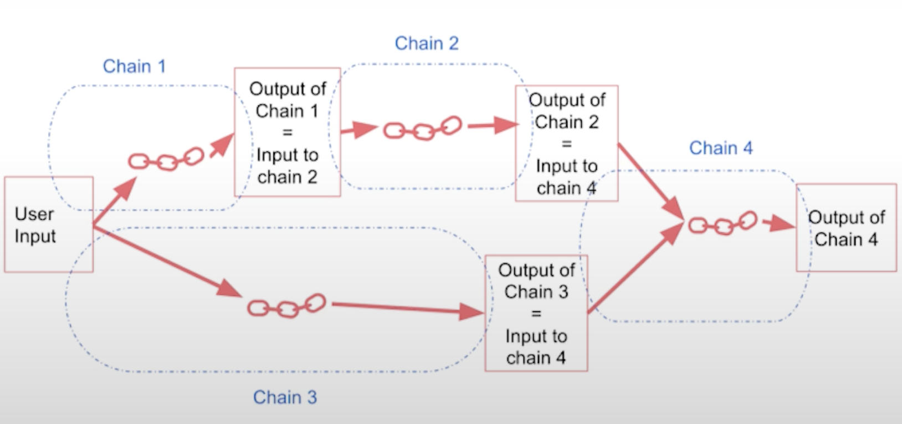

Title: Understanding the Chain in LangChain
Author: Kashish Chanana
Date: 2024-04-27
Category: LLMs
Tags: LangChain


This blog post focuses on a crucial component of LangChain, the "chain". The chain is a tool that integrates a large language model (LLM) with a prompt, enabling the execution of a series of operations on text or other data. In LangChain's context, "Chains" symbolize a predefined series of operations that aim to simplify and transform complex processes into a format that is easier to manage and understand. Chains require a particular sequence of actions and are perfect for workflows with a consistent set of steps, making them ideally suited for fixed, predefined sequences.

## LLM Chain

First, we will discuss the LLM chain, a simple yet powerful component. You need to import the OpenAI model, the chat prompt template, and the LLM chain. By combining the LLM with the prompt, an LLM chain is created. This chain can generate optimal names for companies based on their products. 

In the below example, we run this chain to yield a hypothetical company name corresponding to the product description.

```python

import os
import openai

# load the environment variables
from dotenv import load_dotenv, find_dotenv
_ = load_dotenv(find_dotenv()) # read local .env file
openai.api_key = os.environ['OPENAI_API_KEY']

from langchain.chat_models import ChatOpenAI
from langchain.prompts import ChatPromptTemplate
from langchain.chains import LLMChain

# create the llm model
llm = ChatOpenAI(temperature=0.9, model="gpt-3.5-turbo")

# create the prompt
prompt = ChatPromptTemplate.from_template(
    "What is the best name to describe \
    a company that makes {product}?"
)
# tie llm and prompt together
chain = LLMChain(llm=llm, prompt=prompt)

# run the chain
product = "Queen Size Sheet Set"
chain.run(product)
```

> `Royal Comfort Linens`
> 

---

## Simple Sequential Chain

A simple sequential chain functions as an integrated pipeline, formed by arranging two simple chains in succession. First, we feed the input data into the initial chain, which generates an output. This output then serves as the input for the second chain to produce the final result. This operation always follows a sequential pattern, with the first chain executing before the second, maintaining a fixed, predetermined order.

Building on the same example from above.

```python
from langchain.chains import SimpleSequentialChain
llm = ChatOpenAI(temperature=0.9, model=llm_model)

# Prompt Template 1
first_prompt = ChatPromptTemplate.from_template(
    "What is the best name to describe \
    a company that makes {product}?"
)

# Chain 1
chain_one = LLMChain(llm=llm, prompt=first_prompt)

# Prompt Template 2
second_prompt = ChatPromptTemplate.from_template(
    "Write a 20 words description for the following \
    company:{company_name}"
)
# Chain 2
chain_two = LLMChain(llm=llm, prompt=second_prompt)

# Tying the two chains together
overall_simple_chain = SimpleSequentialChain(chains=[chain_one, chain_two],
                                             verbose=True
                                            )
# Run the chain
overall_simple_chain.run(product)
```

`'Royal Comfort Linens offers luxurious bedding, towels, and bathrobes made from the finest materials for a comfortable and elegant home.'` 

The first chain takes the product description and returns the best name for the company. The second chain takes the company name and generates a 20-word description of the company. By combining these chains in a simple sequential chain, you can get the company name and description for a given product description.

💡 The key takeaway here is that the order of operations remains fixed and adheres to the following sequence: 
Provide input to chain 1 > Retrieve output from chain 1 > Transmit the output from chain 1 to chain 2 > Obtain output from chain 2.

---

## Sequential Chains with Multiple Inputs/Outputs

In some cases, you may have chains with multiple inputs or outputs. 



Lets consider the case where a review is left for your product in French. The review is as below-

```python
{'Review': "Je trouve le goût médiocre. La mousse ne tient pas, c'est bizarre. J'achète les mêmes dans le commerce et le goût est bien meilleur...\nVieux lot ou contrefaçon !?"}
```

 You create multiple chains that translate a review into English, create a summary of the review, detect the language of the review, and ask for a follow-up response in the specified language. These chains are combined in a sequential chain, allowing you to pass the review through each chain and get intermediate outputs.

```python
from langchain.chains import SequentialChain
llm = ChatOpenAI(temperature=0.9, model=llm_model)

# prompt template 1: translate to english
first_prompt = ChatPromptTemplate.from_template(
    "Translate the following review to english:"
    "\n\n{Review}"
)
# chain 1: input= Review and output= English_Review
chain_one = LLMChain(llm=llm, prompt=first_prompt, 
                     output_key="English_Review"
                    )

# prompt template 2: summarize the review
second_prompt = ChatPromptTemplate.from_template(
    "Can you summarize the following review in 1 sentence:"
    "\n\n{English_Review}"
)
# chain 2: input= English_Review and output= summary
chain_two = LLMChain(llm=llm, prompt=second_prompt, 
                     output_key="summary"
                    )

# prompt template 3: translate to english
third_prompt = ChatPromptTemplate.from_template(
    "What language is the following review:\n\n{Review}"
)
# chain 3: input= Review and output= language
chain_three = LLMChain(llm=llm, prompt=third_prompt,
                       output_key="language"
                      )

# prompt template 4: follow up message
fourth_prompt = ChatPromptTemplate.from_template(
    "Write a follow up response to the following "
    "summary in the specified language:"
    "\n\nSummary: {summary}\n\nLanguage: {language}"
)
# chain 4: input= summary, language and output= followup_message
chain_four = LLMChain(llm=llm, prompt=fourth_prompt,
                      output_key="followup_message"
                     )
```

Let us now combine all the 4 chains above.

```python
# overall_chain: input= Review 
# and output= English_Review,summary, followup_message
overall_chain = SequentialChain(
    chains=[chain_one, chain_two, chain_three, chain_four],
    input_variables=["Review"],
    output_variables=["English_Review", "summary","followup_message"],
    verbose=True
)
```

Following from above, input of chain1 leads to output of chain1 which is input for chain2 to produce output of chain2 which is input of chain3 and so on.

```python
{'Review': "Je trouve le goût médiocre. La mousse ne tient pas, c'est bizarre. J'achète les mêmes dans le commerce et le goût est bien meilleur...\nVieux lot ou contrefaçon !?",

 'English_Review': "I find the taste mediocre. The foam doesn't hold, it's weird. I buy the same ones in stores and the taste is much better...\nOld batch or counterfeit!?",

 'summary': 'The reviewer finds the taste mediocre and suspects that the product might be an old batch or counterfeit.',

 'followup_message': "Réponse de suivi:\n\nNous sommes désolés d'apprendre que vous avez été déçu par le goût de notre produit. Nous sommes dévoués à la satisfaction de nos clients et nous prenons cette question très au sérieux. Nous aimerions en savoir plus sur votre expérience pour mieux comprendre ce qui a pu causer ce problème. Pourriez-vous nous fournir plus de détails sur le produit que vous avez acheté et où vous l'avez acheté? Comme vous l'avez mentionné, il est possible que vous ayez reçu un ancien lot ou un produit contrefait, ce qui pourrait avoir un impact sur la qualité. Nous aimerions vous offrir un remboursement ou un produit de remplacement pour résoudre cette situation. Merci de nous donner l'occasion de corriger cette erreur et de regagner votre confiance."}
```

---


## Router Chains

Router Chains allow to dynamically select a pre-defined chain from a set of chains for a given input. Router chains are used to route inputs to different subchains based on specific criteria. 

You define prompts for different subjects (physics, math, history, computer science) and create a router chain to decide which subchain to use based on the input subject. You import the necessary components (multi-prompt chain, LLM router chain, router output parser) and define the language model and destination chains. By combining these elements, you create a router chain that routes inputs to the appropriate subchain.


First, define what the different templates for each of the routes are.

```python
physics_template = """You are a very smart physics professor. \
You are great at answering questions about physics in a concise\
and easy to understand manner. \
When you don't know the answer to a question you admit\
that you don't know.

Here is a question:
{input}"""

math_template = """You are a very good mathematician. \
You are great at answering math questions. \
You are so good because you are able to break down \
hard problems into their component parts, 
answer the component parts, and then put them together\
to answer the broader question.

Here is a question:
{input}"""

history_template = """You are a very good historian. \
You have an excellent knowledge of and understanding of people,\
events and contexts from a range of historical periods. \
You have the ability to think, reflect, debate, discuss and \
evaluate the past. You have a respect for historical evidence\
and the ability to make use of it to support your explanations \
and judgements.

Here is a question:
{input}"""

computerscience_template = """ You are a successful computer scientist.\
You have a passion for creativity, collaboration,\
forward-thinking, confidence, strong problem-solving capabilities,\
understanding of theories and algorithms, and excellent communication \
skills. You are great at answering coding questions. \
You are so good because you know how to solve a problem by \
describing the solution in imperative steps \
that a machine can easily interpret and you know how to \
choose a solution that has a good balance between \
time complexity and space complexity. 

Here is a question:
{input}"""
```

Second, collect all the templates together as below to have all information about name of the destination chain, its description and the prompt template.

```python
prompt_infos = [
    {
        "name": "physics", 
        "description": "Good for answering questions about physics", 
        "prompt_template": physics_template
    },
    {
        "name": "math", 
        "description": "Good for answering math questions", 
        "prompt_template": math_template
    },
    {
        "name": "History", 
        "description": "Good for answering history questions", 
        "prompt_template": history_template
    },
    {
        "name": "computer science", 
        "description": "Good for answering computer science questions", 
        "prompt_template": computerscience_template
    }
]
```

Next, define the destination and default chain.

```python
from langchain.chains.router import MultiPromptChain
from langchain.chains.router.llm_router import LLMRouterChain,RouterOutputParser
from langchain.prompts import PromptTemplate

llm = ChatOpenAI(temperature=0, model=llm_model)

destination_chains = {}
for p_info in prompt_infos:
    name = p_info["name"]
    prompt_template = p_info["prompt_template"]
    prompt = ChatPromptTemplate.from_template(template=prompt_template)
    chain = LLMChain(llm=llm, prompt=prompt)
    destination_chains[name] = chain  
    
destinations = [f"{p['name']}: {p['description']}" for p in prompt_infos]
destinations_str = "\n".join(destinations)

# define default prompt chain
default_prompt = ChatPromptTemplate.from_template("{input}")
default_chain = LLMChain(llm=llm, prompt=default_prompt)
```

Next, define the template for router chain.

```python
MULTI_PROMPT_ROUTER_TEMPLATE = """Given a raw text input to a \
language model select the model prompt best suited for the input. \
You will be given the names of the available prompts and a \
description of what the prompt is best suited for. \
You may also revise the original input if you think that revising\
it will ultimately lead to a better response from the language model.

<< FORMATTING >>
Return a markdown code snippet with a JSON object formatted to look like:
```json
{{{{
    "destination": string \ name of the prompt to use or "DEFAULT"
    "next_inputs": string \ a potentially modified version of the original input
}}}}

<< CANDIDATE PROMPTS >>
{destinations}

<< INPUT >>
{{input}}

<< OUTPUT (remember to include the ```json)>>"""
```
"destination" must be one of the candidate prompt names specified below OR it can be "DEFAULT" if the input is not
well suited for any of the candidate prompts. "next_inputs" can just be the original input 
if you don't think any modifications are needed.

Next, define the router chain.

```python
router_template = MULTI_PROMPT_ROUTER_TEMPLATE.format(
    destinations=destinations_str
)
router_prompt = PromptTemplate(
    template=router_template,
    input_variables=["input"],
    output_parser=RouterOutputParser(),
)

router_chain = LLMRouterChain.from_llm(llm, router_prompt)
```

Then, tie all the chains together, namely the main router chain, the destination chains and the default chain.

```python
chain = MultiPromptChain(router_chain=router_chain, 
                         destination_chains=destination_chains, 
                         default_chain=default_chain, verbose=True
                        )
```

And finally, run the chain.

```python
chain.run("What is black body radiation?")
## calls the Physics destination chain
```

```python
chain.run("what is e^3")
## calls the Maths destination chain
```

## Conclusion

LangChain provides several building blocks for creating chains, such as LLM chains, sequential chains, and router chains. These building blocks allow you to perform various operations on text or data in a structured and sequential manner, opening up possibilities for creating interesting applications.