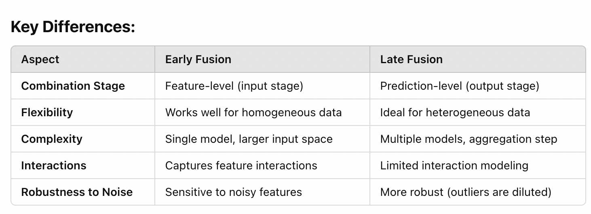

Title: A Tour of Machine Learning Architectures
Date: 2025-01-06
Modified: 2025-01-06
Tags: Architecture Patterns
Authors: Kashish Chanana

Machine learning architectures are the backbone of any intelligent system, defining how models process inputs from various data modalities. This guide explores early fusion, late fusion, and hybrid fusion techniques, providing practical examples and scenarios.

[TOC]

## **Multi-Task Classifier**

1. Shared Feature Extractor: 
Use a shared model (e.g., a BERT encoder or CNN) to extract features from the input data.
This layer learns a common representation useful across all tasks.

2. Task-Specific Heads: 
Add separate fully connected layers for each classification task:
Task 1: A dense layer with softmax activation for sentiment prediction.
Task 2: A dense layer with softmax activation for category prediction.
Task 3: A dense layer with sigmoid activation for multi-label classification.

3. Loss Functions: 
Each task uses an appropriate loss function:
Task 1 & Task 2: Categorical Cross-Entropy.
Task 3: Binary Cross-Entropy.
Combine the losses into a weighted sum during training.

4. Training: 
Provide labels for all tasks in the training loop.
Train the model to optimize all tasks simultaneously.


### Model Architecture

```plaintext
Input (e.g., text or image)
        |
Shared Feature Extractor (e.g., BERT, ResNet, CNN)
        |
        +--> Task 1 Head (Sentiment Classification, Softmax)
        |
        +--> Task 2 Head (Category Classification, Softmax)
        |
        +--> Task 3 Head (Tag Classification, Sigmoid)
```

---

### Example Code (TensorFlow/Keras)

```python
import tensorflow as tf
from tensorflow.keras import layers, models
from transformers import TFBertModel

# Input Layer
input_layer = tf.keras.Input(shape=(512,), name="text_input")  # Example for text input (BERT token IDs)

# Shared Feature Extractor (e.g., BERT)
bert_model = TFBertModel.from_pretrained("bert-base-uncased")
shared_features = bert_model(input_layer).pooler_output  # Extract shared features

# Task 1: Sentiment Classification (Multi-class)
task1_output = layers.Dense(3, activation="softmax", name="task1_output")(shared_features)

# Task 2: Category Classification (Multi-class)
task2_output = layers.Dense(5, activation="softmax", name="task2_output")(shared_features)

# Task 3: Tag Classification (Multi-label)
task3_output = layers.Dense(10, activation="sigmoid", name="task3_output")(shared_features)

# Create the Multi-Task Model
model = models.Model(inputs=input_layer, outputs=[task1_output, task2_output, task3_output])

# Compile the Model with Task-Specific Losses
model.compile(
    optimizer="adam",
    loss={
        "task1_output": "categorical_crossentropy",
        "task2_output": "categorical_crossentropy",
        "task3_output": "binary_crossentropy",
    },
    metrics={
        "task1_output": "accuracy",
        "task2_output": "accuracy",
        "task3_output": "binary_accuracy",
    }
)

# Display the Model Summary
model.summary()
```

---

### Training the Model

Prepare the data:
- For Task 1 & Task 2, labels should be one-hot encoded vectors.
- For Task 3, labels should be binary vectors indicating the presence/absence of each tag.

Train the model:
```python
history = model.fit(
    x=text_data,  # Input data (e.g., tokenized text for BERT)
    y={
        "task1_output": sentiment_labels,  # Labels for Task 1
        "task2_output": category_labels,  # Labels for Task 2
        "task3_output": tag_labels,  # Labels for Task 3
    },
    batch_size=32,
    epochs=20,
    validation_split=0.2
)
```

---

### Key Points to Consider

1. Loss Weighting:
Adjust the weights for each task's loss if one task is more important or has different scales:
```python
   model.compile(
       optimizer="adam",
       loss={
           "task1_output": "categorical_crossentropy",
           "task2_output": "categorical_crossentropy",
           "task3_output": "binary_crossentropy",
       },
       loss_weights={
           "task1_output": 1.0,
           "task2_output": 0.5,
           "task3_output": 0.8,
       },
       metrics={
           "task1_output": "accuracy",
           "task2_output": "accuracy",
           "task3_output": "binary_accuracy",
       }
   )
```

2. Evaluation:
   Use task-specific evaluation metrics (e.g., precision, recall, F1-score for multi-label tasks).

3. Shared Representation:
   The shared feature extractor should be powerful enough to learn representations useful for all tasks. If tasks are too different, consider partially shared layers or a hybrid approach.

4. Transfer Learning:
   You can initialize the shared extractor with pre-trained models (e.g., BERT for text, ResNet for images) to improve performance.

## **Two-Tower Machine Learning Network**
A Two-Tower Machine Learning Network (or Two-Tower Model) is a specialized neural network architecture designed to efficiently handle tasks involving two different data inputs or entities, such as matching, ranking, or retrieval. It is often used in recommendation systems, search engines, and other applications requiring similarity estimation between two entities.

### How It Works
The Two-Tower network architecture consists of two separate neural networks (towers) that independently process different input data types. The outputs of these towers are then compared or combined to produce the final prediction.

### Components of a Two-Tower Network
1. Two Towers:
Each tower processes one type of input.
Towers are typically deep neural networks (DNNs), but their architecture can vary based on the input data type (e.g., CNN for images, RNN for sequences).

2. Shared or Independent Embedding Space: 
The outputs of the towers are embedded into a shared representation space, where comparisons are made.

3. Similarity Metric:
The embeddings from the two towers are combined using a similarity metric (e.g., dot product, cosine similarity, or Euclidean distance).

4. Final Output:
The similarity score is used for the final prediction (e.g., a ranking score, matching probability, etc.).

### Key Steps in Two-Tower Models
1. Input Representation
Each tower receives a different input. For example:
Tower 1: Query data (e.g., a search term or user profile).
Tower 2: Candidate data (e.g., document, item, or product).

2. Feature Extraction:
Each tower independently extracts features from its respective input using layers such as:
Dense layers for tabular data,
CNNs for images,
Transformers for text,
Embedding Generation
The features are transformed into embeddings (dense vectors) representing the inputs in a shared space.

3. Similarity Calculation
Compare the embeddings from both towers using a similarity function:
similarity_score = dot(embedding1, embedding2)

4. Optimization
The model is trained to maximize the similarity for matching pairs and minimize it for non-matching pairs using a loss function like contrastive loss or cross-entropy.

5. Example Use Cases

> **Recommendation Systems**

> Tower 1: User data (e.g., profile, past interactions).

> Tower 2: Item data (e.g., product description, metadata).

> Output: Relevance score indicating how well the item matches the user's preferences.


> **Search Engines**

> Tower 1: Query (e.g., search terms).

> Tower 2: Document (e.g., webpage content).

> Output: Relevance score used to rank documents.

> **Ad Matching**

> Tower 1: User profile.

> Tower 2: Advertisement features.

> Output: Likelihood of the user clicking on the ad.


Example Code for a Two-Tower Model
Here's a simplified implementation in TensorFlow/Keras:

```python
import tensorflow as tf
from tensorflow.keras import layers, Model

# Define the first tower (e.g., user features)
user_input = tf.keras.Input(shape=(num_user_features,), name="user_input")
user_tower = layers.Dense(128, activation="relu")(user_input)
user_tower = layers.Dense(64, activation="relu")(user_tower)
user_embedding = layers.Dense(32, activation="relu", name="user_embedding")(user_tower)

# Define the second tower (e.g., item features)
item_input = tf.keras.Input(shape=(num_item_features,), name="item_input")
item_tower = layers.Dense(128, activation="relu")(item_input)
item_tower = layers.Dense(64, activation="relu")(item_tower)
item_embedding = layers.Dense(32, activation="relu", name="item_embedding")(item_tower)

# Compute similarity (dot product in this case)
similarity = layers.Dot(axes=1, normalize=True, name="similarity")([user_embedding, item_embedding])

# Define the model
model = Model(inputs=[user_input, item_input], outputs=similarity)
model.compile(optimizer="adam", loss="binary_crossentropy", metrics=["accuracy"])

# Example: Train the model
history = model.fit(
    [user_features, item_features],  # Input data
    labels,                         # Matching labels (1 for match, 0 for no match)
    batch_size=32,
    epochs=10
)
```

### Advantages of Two-Tower Models
1. Scalability: Embedding vectors can be precomputed for one tower (e.g., items in a catalog) and reused across queries.
2. Modularity: Each tower is trained to specialize in its own input type.
3. Efficiency: Enables large-scale retrieval tasks using Approximate Nearest Neighbor (ANN) techniques for precomputed embeddings.

### Limitations
1. Interaction Modeling: Two-tower models do not explicitly model interactions between input modalities, unlike joint architectures (e.g., cross-attention networks).
2. Embedding Space Alignment: Training requires careful alignment of the embedding spaces to ensure meaningful similarity measures.
3. Cold Start Problem: If there is insufficient data for one of the towers (e.g., new users or items), the model may struggle.

### When to Use Two-Tower Models
1. When computational efficiency and scalability are critical.
2. For applications with two distinct input domains that need to be compared or matched.
3. For tasks where embeddings can be precomputed to speed up inference (e.g., retrieval systems).


## **Early Fusion Example (Feature-Level Fusion)**
#### Scenario
You want to predict a user's sentiment based on textual data and a corresponding image(e.g., a post on social media).

#### Steps
1. Extract features from both modalities
   - Use a Text Encoder (e.g., a pre-trained BERT model) to generate embeddings for the text.
   - Use an Image Encoder (e.g., ResNet or a CNN) to extract features from the image.
2. Concatenate the feature vectors (early fusion)
   ```
   Combined_Features = Concatenate([Text_Features, Image_Features])
   ```
3. Feed the combined features into a single machine learning model (e.g., a fully connected neural network).
4. Train the model to predict sentiment based on the unified representation.

#### Example Code (Pseudocode)
```python
# Extract text and image features
text_features = bert_model(text_input)
image_features = resnet_model(image_input)

# Early fusion Combine features
combined_features = concatenate([text_features, image_features])

# Feed into a unified model
prediction = dense_layer(combined_features)
```

#### Advantages
- Captures interactions between text and image data.
- Single model simplifies deployment.

#### Limitations
- Requires careful handling of different feature scales.
- Can lead to very large input sizes.

---

## **Late Fusion Example (Decision-Level Fusion)**

#### Scenario
You want to classify news articles using text data and reader engagement metrics (e.g., clicks, likes).

#### Steps
1. Train separate models for each modality
   - A Text Classification Model (e.g., using a transformer) to classify the text.
   - A Tabular Data Model (e.g., XGBoost) to predict based on engagement metrics.
2. Generate predictions (e.g., probabilities) from each model
   ```
   Text_Model_Prediction = [0.7, 0.2, 0.1]  # Probabilities for 3 classes
   Tabular_Model_Prediction = [0.6, 0.3, 0.1]
   ```
3. Combine predictions using a late fusion technique
   - Weighted average
     ```
     Final_Prediction = 0.6 * Text_Model_Prediction + 0.4 * Tabular_Model_Prediction
     ```
   - Voting or ensemble techniques.

4. Use the combined prediction for the final decision.

#### Example Code (Pseudocode)
```python
# Generate predictions from individual models
text_pred = text_model.predict(text_input)
tabular_pred = tabular_model.predict(tabular_input)

# Late fusion Combine predictions (weighted average)
final_pred = 0.6 * text_pred + 0.4 * tabular_pred
```

#### Advantages
- Each model specializes in its own data modality.
- More robust to noisy data in one source.

#### Limitations
- Does not capture direct interactions between text and engagement features.
- Coordination between models can increase complexity.

---

### When to Choose Early vs. Late Fusion

#### Early Fusion
- If feature interactions are important, such as combining complementary information from different modalities (e.g., text and image for sentiment).
- When the data sources have similar structures, enabling feature-level merging.

#### Late Fusion
- If data sources are heterogeneous or require specialized models (e.g., image vs. tabular data).
- When leveraging ensemble techniques to combine strengths of different models.
- To add modularity for easier updates (e.g., replacing one model without retraining the entire system).


---

## Hybrid Fusion
You can also mix both techniques
- Combine some features early (e.g., combine image and audio features for a video analysis model).
- Use late fusion to merge the prediction with another modality (e.g., textual analysis of video captions).

## **Multi-Label Classifier with Early Fusion**
A multi-label classifier predicts multiple labels simultaneously (e.g., tagging an image with multiple attributes like "cat," "outdoor," "sunny"). Combining data from multiple sources (e.g., images and text) with early fusion involves merging features at the input level. Here's a step-by-step guide.

1. Data Collection
Ensure you have multiple data sources for each instance, such as:
Images: Visual content of the instance.
Text: Descriptions, captions, or metadata.
Tabular Data (optional): Associated numerical or categorical features.
2. Preprocessing
Image Data:
Normalize pixel values (e.g., scale to [0, 1]).
Use an image encoder (e.g., ResNet, EfficientNet) to extract feature vectors.
Text Data:
Tokenize and process text (e.g., using a pre-trained model like BERT) to generate embeddings.
Tabular Data (if applicable):
Normalize numerical features and encode categorical features.
3. Feature Fusion (Early Fusion)
Extract features from each modality and concatenate them to create a unified representation.
Ensure all feature vectors have compatible dimensions (use projections if needed).
4. Multi-Label Classification Model
Use a fully connected neural network (dense layers) as the classifier.
The output layer should have one neuron per label, with an activation function such as sigmoid (to output probabilities for each label).
5. Loss Function
Use Binary Cross-Entropy Loss for multi-label classification:
plaintext
Copy code
Loss = - ∑ [y_true * log(y_pred) + (1 - y_true) * log(1 - y_pred)]
This treats each label as an independent binary classification problem.
6. Training
Train the model using the combined feature representation as input and the multi-label target as the output.

Image Input --> Image Encoder --> Image Features
Text Input  --> Text Encoder  --> Text Features
Tabular Data (Optional)       --> Tabular Features

Combined Features = Concatenate([Image Features, Text Features, Tabular Features])

Combined Features --> Dense Layers --> Output Layer (Sigmoid Activations for Multi-Label Predictions)


```python
import tensorflow as tf
from tensorflow.keras import layers, models
from transformers import TFBertModel

# Input layers for different data sources
image_input = tf.keras.Input(shape=(224, 224, 3), name="image_input")
text_input = tf.keras.Input(shape=(512,), name="text_input")  # Assume 512 tokens
tabular_input = tf.keras.Input(shape=(10,), name="tabular_input")  # Example tabular data with 10 features

# Image Encoder (e.g., ResNet)
image_encoder = tf.keras.applications.ResNet50(include_top=False, pooling="avg")
image_features = image_encoder(image_input)

# Text Encoder (e.g., BERT)
bert_model = TFBertModel.from_pretrained("bert-base-uncased")
text_features = bert_model(text_input).pooler_output

# Optional Tabular Features
tabular_features = layers.Dense(64, activation="relu")(tabular_input)

# Early fusion: Combine features
combined_features = layers.concatenate([image_features, text_features, tabular_features])

# Dense layers for classification
x = layers.Dense(128, activation="relu")(combined_features)
x = layers.Dropout(0.5)(x)
output = layers.Dense(num_labels, activation="sigmoid", name="multi_label_output")(x)  # Sigmoid for multi-label

# Build and compile the model
model = models.Model(inputs=[image_input, text_input, tabular_input], outputs=output)
model.compile(optimizer="adam", loss="binary_crossentropy", metrics=["accuracy"])
```

To create a multi-task classifier, where you handle multiple classification tasks simultaneously, you follow a similar approach to the general multi-task learning process but tailor it specifically for classification tasks.

---

### Example Use Case
Imagine a dataset containing textual data about customer reviews. You want to:
1. Task 1: Predict the review's sentiment (multi-class classification: positive, neutral, negative).
2. Task 2: Predict the review's category (multi-class classification: electronics, books, clothing).
3. Task 3: Identify relevant tags (multi-label classification: "cheap," "durable," "trendy").

---
