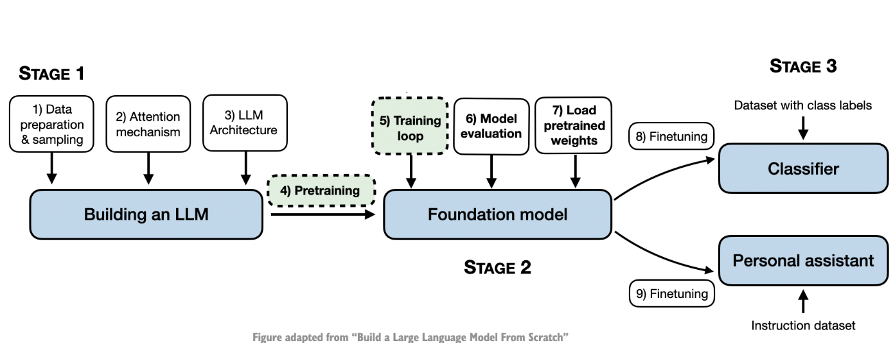

Title: Pretraining an LLM
Date: 2024-09-02
Category: Scratch
Tags: LLMs From Scratch, PreTraining


This blog post is a Part III of building an LLM from scratch. Yet another post based out of a coding workshop - Building LLMs from the Ground Up: A 3-hour Coding Workshop by Sebastian Raschka. This blog is based out of training the LLM on the data that was created in Part I - A Simple Tokenizer. Since the dataset that is being used is of relatively small size (in fact, only one short story), the training finishes relatively fast (minutes instead of weeks). To put in context, the short story has 5145 tokens while Llama 2 7B was trained on 2 trillion tokens that required 184,320 GPU hours on A100 GPUs.



```python
train_test_split = 0.9
split_idx = int(len(verdict_text) * train_test_split)

tokenizer = tiktoken.get_encoding("gpt2")
torch.manual_seed(123)

train_dataset = GPTDataset(text=verdict_text[:split_idx], 
                           tokenizer=tokenizer,
                           context_length=GPT_CONFIG_124M.get("context_length"),
                           stride=GPT_CONFIG_124M.get("context_length"))

test_dataset = GPTDataset(text=verdict_text[split_idx:],
                        tokenizer=tokenizer,
                        context_length=GPT_CONFIG_124M.get("context_length"),
                        stride=GPT_CONFIG_124M.get("context_length"))

train_loader = DataLoader(train_dataset, batch_size=2, shuffle=True, drop_last=True)
test_loader = DataLoader(test_dataset, batch_size=2, shuffle=False, drop_last=False)
```